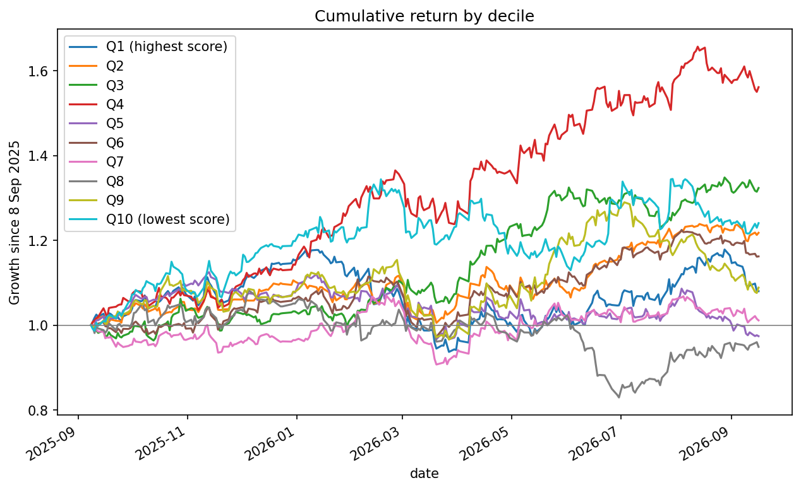

# Point-in-Time Multi-Factor Ranking — EuroStoxx 50

48 of the EuroStoxx 50 stocks are ranked by this algorithm from 8 September 2025 to 16 September 2026. EuroStoxx 50 prices and fundamentals are used in formulas that measure valuation, credit and balance-sheet health, quality and growth.

## Result

| Metric | Value |
|---|---|
| Rank IC (Spearman, score vs. 12-month forward return, 48 stocks) | **+0.14** |
| Decile Spearman (10 buckets of 5 stocks, last one of 3; bucket rank vs. bucket return) | +0.21 |
| Octile Spearman (robustness check: 8 equal buckets of 6 stocks) | +0.05 |
| Ranking date | 8 Sep 2025 |
| Evaluation window | 8 Sep 2025 → 16 Sep 2026 (262 trading days) |



The result was separated individually and by Deciles. Individually the ~0.14 Spearman Correlation indicates a positive result, where top ranked stocka tended to perform better than low ranked. However, with a single date it does not provide a very reliable one and we can observe that my worst decile beats the top one (due to a surprising performance by Bayer: +73.9%). On the other hand the Decile ~0.21 Spearman Correlation indicates a bigger scramble but a correct direction. With eight equal groups of six stocks it drops to ~0.05, so the bucket result depends heavily on how the stocks are grouped. I will keep running the script on future dates to corroborate the results.

## Why point-in-time

Point-in-time is necessary to avoid look-ahead bias. Using today's fundamentals to rank stocks as of a year ago would give a biased perspective, since fundamentals reflect what happened during the past year. E.g., if a company had higher growth and ROE during that year, it would automatically be ranked higher than others. You would be predicting a good year with the numbers generated by that same good year.

I avoided this look-ahead bias by using financial statements from FY2024 and FY2023. Information in both statements was already public by 8 September 2025. Valuation ratios use closing prices from 8 September 2025, and returns are measured from that date.

## Pipeline

Run the three scripts in order from the project folder:

| Step | Script | Input | Output |
|---|---|---|---|
| 1 | `sx5e_constituents.py` | Yahoo Finance (yfinance) | `sx5e_prices.csv` (adjusted closes, Jan 2025 → Sep 2026) |
| 2 | `sx5e_preprocesamiento.py` | `statements_FY2024_FY2023_ALL.csv`, `sx5e_prices.csv`, `fundamentales_EUROSTOXX50.csv` (sector labels only) | `fundamentales_EUROSTOXX50_PIT.csv` |
| 3 | `sx5e_ranking.py` | `fundamentales_EUROSTOXX50_PIT.csv`, `sx5e_prices.csv` | Ranking, decile backtest, rank IC, chart |

## Model

Each metric is converted to a **cross-sectional percentile rank** (0–1) within the universe, with the direction set so that 1 is always "better". Metrics are combined into five factor groups:

| Group | Metrics | Better when |
|---|---|---|
| Valuation | P/E, P/B, P/S, EV/EBITDA | Lower |
| Quality | ROE, ROA, profit margin, operating margin | Higher |
| Growth | Earnings growth, sales growth (FY2024 vs FY2023) | Higher |
| Balance sheet | Debt/equity, debt/assets, net debt/EBITDA, current ratio | Stronger |
| Dividend | Dividend yield | Higher |

**Missing data.** Banks and insurers do not report operating income, gross profit or current ratios. Each group score is a weighted average over the metrics available for that company, with weights renormalized to sum to one, so missing metrics do not penalize a stock.

**Sector-specific weights.** Financials are scored without the balance-sheet group:

| Group | Non-financials | Financials |
|---|---|---|
| Growth | 0.28 | 0.35 |
| Quality | 0.24 | 0.30 |
| Valuation | 0.20 | 0.25 |
| Balance sheet | 0.20 | — |
| Dividend | 0.08 | 0.10 |

## Evaluation

- **Rank IC:** Spearman correlation between each stock's composite score and its total return over the evaluation window.
- **Decile backtest:** stocks are sorted by score into ten equal-weighted buckets of five stocks (the last bucket has three, since 48 is not divisible by 10), and the cumulative return of each bucket is tracked from the ranking date. As a robustness check, the same test with eight equal buckets of six stocks gives +0.05.

## Assumptions and limitations

- **Single evaluation date.** Measuring performance on one date does not deliver a reliable result, since a good or bad outcome may be the coincidence of a single 12-month period.
- **Forward P/E.** It depends on analysts' estimates at the time, and no free source stores past ones, so it is left empty. The growth metric built from it (forward P/E vs trailing P/E) is therefore unused as well.
- **Annual data only.** Quarterly statements would have given more precise and up-to-date data, but they are not available that far back from free sources. On the ranking date, FY2024 figures were up to eight months old.
- **Currency.** Some companies report in dollars while their prices are in euros. Ratios built from two statement figures (ROE, margins, growth) are unaffected, since the currency cancels out, but price-based ratios (P/E, P/B, P/S, EV/EBITDA, dividend yield) are slightly distorted for those three stocks.
- **Non-December fiscal years.** Some companies do not end their fiscal year in December, so the comparison is not perfect. Look-ahead bias is still avoided, as all the information was public by the start of the measurement.
- **Survivorship bias.** Only companies that are in the index today were used, so companies that left the index after September 2025 are missing.
- **Adjusted prices.** Prices are dividend-adjusted, so valuation metrics are slightly affected.
- **Outliers.** Some extreme values exist: Adidas shows immense earnings growth because its 2023 earnings were near zero. The percentile ranking limits their effect, since an extreme value simply ends up first or last.
- **Judgment-based weights.** Weights were chosen before analyzing results, to avoid overfitting. Choosing weights by maximizing performance on the same data used for the test would fit the noise of this particular period and make the model look better than it really is. The unusual decimals (e.g. 0.1725) come from rebalancing the weights to sum to one each time a new metric was added.
- **No transaction costs.** The backtest assumes buying and selling is free, so real returns would be slightly lower.

## Next steps

- **Multi-date IC:** repeat the ranking at several past dates using FY2021–FY2024 statements, and report the average IC and its stability.
- Extend the pipeline to other indices (IBEX 35, S&P 100, Nasdaq 100).
- Sector-neutral ranking, so the score measures stock selection rather than sector bets.

## Setup

```
pip install yfinance pandas numpy matplotlib
python sx5e_constituents.py
python sx5e_preprocesamiento.py
python sx5e_ranking.py
```

## AI assistance

Parts of this project were built with help from Claude (Anthropic):

- **Data collection:** the FY2024 and FY2023 annual financial statements were gathered by an AI agent (Claude Cowork) using `yfinance`.
- **Point-in-time preprocessing:** `sx5e_preprocesamiento.py`, which rebuilds the ratios from the raw statements as of the ranking date, was written with Claude.
- **Debugging and code fixes:** Claude also helped fix file paths.

The factor model itself (choice of metrics, factor groups, weights, sector-specific treatment of financials and missing-data handling) and the backtest design are my own work. I have reviewed the AI-written code and can explain how it works.

## Data

Prices and financial statements come from Yahoo Finance via the `yfinance` library, used here for educational purposes.
